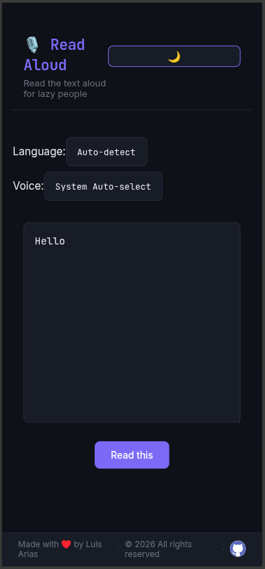
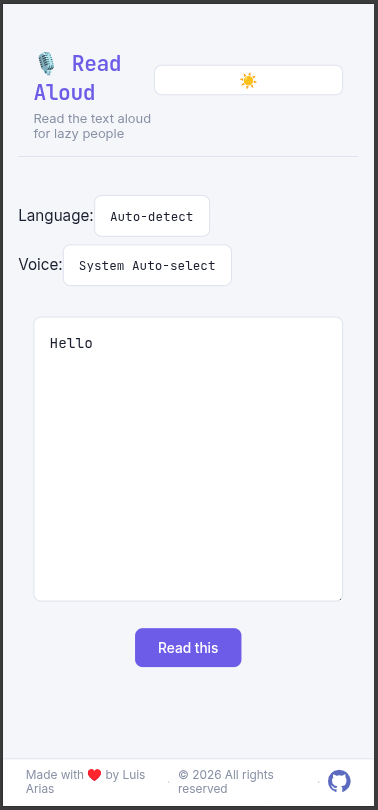

# 🎙️ Read aloud for lazy people

A simple, efficient, and high-quality application to convert text into natural-sounding speech using Microsoft Edge's neural engine.

## 🚀 Key Features
- **Neural Voices:** Professional, natural, and fluid audio quality.
- **Variety:** Random voice selection to prevent auditory fatigue.
- **Multi-Accent Support:** Supports voices from Spain, Mexico, Argentina, Colombia, and more.
- **Multilanguage:** Voices are selected according to the language of the text.
- **Lightweight:** Uses modern, efficient libraries (`edge-tts` and `miniaudio`).
- **High Fidelity:** Generates top-tier audio files from your text.
- **Web UI:** User-friendly React-based interface with dark and light theme support.

## 🖼️ UI Screenshots

| Dark Mode | Light Mode |
|-----------|------------|
|  |  |

## 🛠 Requirements
- **Python 3.8+** installed on your system.
- **Node.js** (for the React frontend)
- Internet connection (required for generating the high-quality audio).

## ⚙️ Environment Variables

| Variable | Required | Description |
|----------|----------|-------------|
| ALLOWED_LANGUAGES | No | Comma-separated list of allowed languages. Default: `en,es,pt` |
| MISTRAL_API_KEY | No | Your Mistral API key |

## 📦 Installation

1. **Clone this repository or download the script:**

2. **Create environment**
```bash

python -m venv .venv
source .venv/bin/activate


```


3. **Install the necessary dependencies:**
```bash

pip install -r requirements.txt

```

4. **Install frontend dependencies:**
```bash

npm install
```


## 🚀 Usage

1. Start the Python backend server:
```bash
npm run start:py
```

2. Start the React development server:
```bash
npm run dev
```

**Start the React development server:**
```bash
npm run build
gunicorn -w 4 -b 0.0.0.0:8000 --pythonpath backend main:app
```

3. Open your browser to `http://localhost:5173` (or the port shown in the terminal)

4. Enter or paste your text in the input area
5. Optionally select a voice and language from the dropdown, or let the backend auto-select based on the text
6. Click "Read this" to generate and play the speech


## 💡 Notes

* This script is designed to be simple and functional.
* You can easily extend the logic to change voices between paragraphs for a more dynamic reading experience.
* Voice and language can be auto-selected by the backend based on the text content, or manually selected by the user from the UI.

## 📜 License

This project is open-source. Feel free to use, modify, and improve it as you wish.


